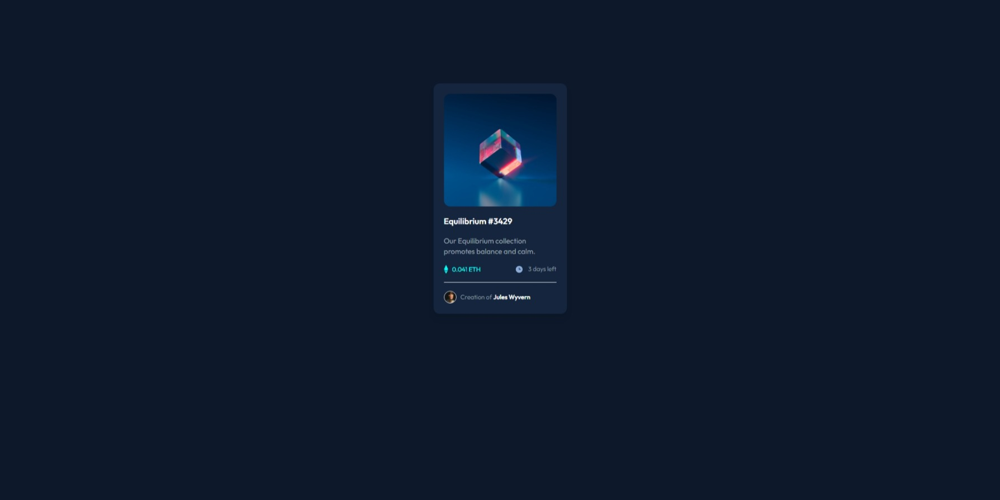

 Frontend Mentor - NFT preview card component solution

This is a solution to the [NFT preview card challenge on Frontend Mentor](https://www.frontendmentor.io/challenges/qr-code-component-iux_sIO_H). Frontend Mentor challenges help you improve your coding skills by building realistic projects. 

## Table of contents

- [Overview](#overview)
  - [Screenshot](#screenshot)
  - [Links](#links)
- [My process](#my-process)
  - [Built with](#built-with)
  - [What I learned](#what-i-learned)
- [Author](#author)
- [Acknowledgments](#acknowledgments)

## Overview

### Screenshot



### Links

- Live Site URL: (https://dapper-alfajores-b79757.netlify.app/)

## My process

### Built with

- HTML 5
- CSS
- TailwindCSS

### What I learned

I used this project to learn about tailwind, it was really fun to use utility classes to style the component and i think it made the development faster.

```html
<div class="relative">
    
    <div class="rounded-xl opacity-0 hover:opacity-75 duration-300 absolute inset-0 w-54 h-54 z-10 text-white hover:bg-[#00fff7]">
        
    </div>
</div>
```

## Author

- Website - [João Victor Ribeiro](https://github.com/jvictorribeiro)
- Frontend Mentor - [@yourusername](https://www.frontendmentor.io/profile/@jvictorribeiro)